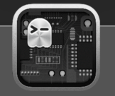
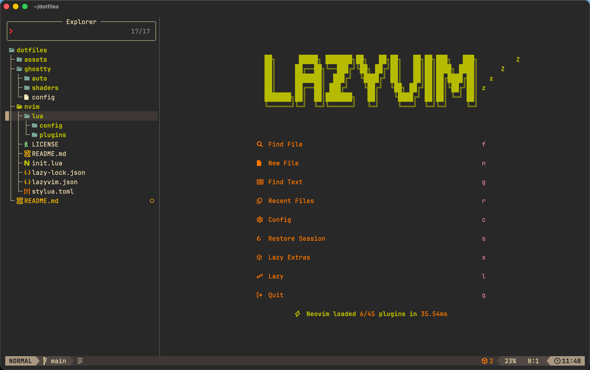
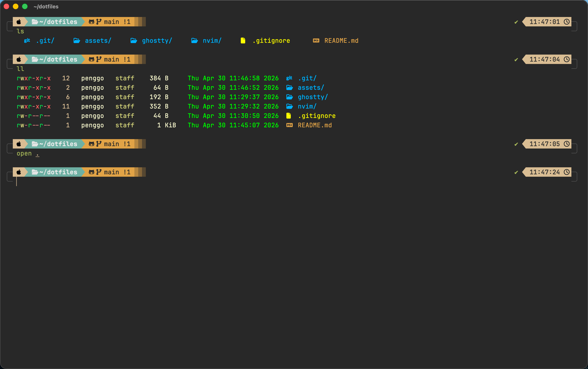

#  Penggo's Dotfiles

我的个人 macOS 开发环境配置，主打极速、简洁与高效。目前主要包含 **Neovim** 和 **Ghostty** 的配置。

## 📸 效果预览 (Screenshots)

| Neovim | Ghostty |
| :---: | :---: |
|  |  |

## 🛠 包含的工具与配置

- **[Neovim](https://neovim.io/):** 高度定制的终端编辑器配置（使用 Lua 编写），旨在提供类似 IDE 的体验。
- **[Ghostty](https://ghostty.org/):** GPU 加速的现代终端模拟器配置，包含自定义主题与着色器（Shaders）。

## 📂 目录结构

```text
.
├── nvim/      # Neovim 配置文件 (~/.config/nvim)
├── ghostty/   # Ghostty 终端配置 (~/Library/Application Support/com.mitchellh.ghostty)
├── assets/    # 图标与预览图截图存放目录
└── README.md
```

## ⚡️ 快速安装 (Installation)

> [!WARNING]  
> **警告：** 以下脚本将会覆盖你现有的配置，请在执行前备份自己的文件！

你可以通过 `git clone` 下载仓库，并使用软链接（Symlinks）将配置文件映射到系统中。

### 1. 克隆仓库

```bash
git clone https://github.com/penggo/dotfiles.git ~/dotfiles
cd ~/dotfiles
```

### 2. 建立软链接 (Symlinking)

你可以使用以下原生命令手动链接：

#### 链接 Neovim

```bash
# 备份旧配置 (如果存在)
mv ~/.config/nvim ~/.config/nvim.bak 2>/dev/null || true

# 创建软链接
ln -s ~/dotfiles/nvim ~/.config/nvim
```

#### 链接 Ghostty (macOS)

```bash
# 备份并清理旧配置
GHOSTTY_DIR="$HOME/Library/Application Support/com.mitchellh.ghostty"
mv "$GHOSTTY_DIR" "${GHOSTTY_DIR}.bak" 2>/dev/null || true

# 创建软链接
ln -s ~/dotfiles/ghostty "$GHOSTTY_DIR"

# 推荐同时在 ~/.config 下也做一个链接
mkdir -p ~/.config/ghostty
ln -s ~/dotfiles/ghostty/config ~/.config/ghostty/config
```

## 🤝 贡献与反馈

这是我的个人配置，可能高度定制化并绑定了我的个人习惯。不过，如果你发现了 bug 或者有让它变得更好的建议，欢迎提交 Issues 或 Pull Requests！

## 📄 License

[MIT License](LICENSE)
